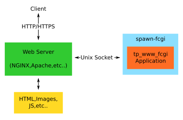
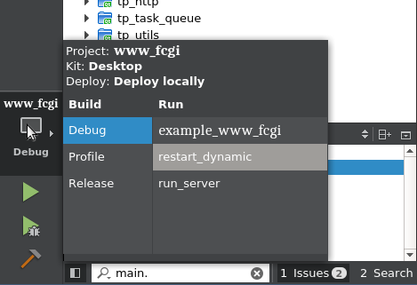

# Use tp_www in Qt Creator

This module allows you to run fast CGI processes inside Qt Creator and can be used as a reference 
for deployment or running these apps from the command line.



This works by running an NGINX web server and then using spawn-fcgi to run your application as a 
fCGI process.

## Installation

### Fedora
```
dnf install -y fcgi-devel nginx spawn-fcgi psmisc

```

### Ubuntu
```
apt install -y libfcgi-dev nginx spawn-fcgi psmisc

```
## Use



There are a few steps required to run your application.

1. In Qt Creator select run_server from the build menu. 
2. Click the play button to build and run the run_server process. This will start NGINX and 
configure it to connect to a fCGI process that we will start next. You only need to do this once.
3. In Qt Creator select restart_dynamic from the build menu.
4. Click the play button to start your fCGI process. This will use spawn-fcgi to run your app code.
5. Repeat step 4 to restart the app.
6. Symlink your htm dir into your build dir eg: ```ln -snf ../www_fcgi/example_www_fcgi/htm/ htm```
7. Open http://localhost:9001/ in your web browser.

Ignore this error it does not cause any problems:
```
nginx: [alert] could not open error log file: open() "/var/log/nginx/error.log" failed (13: Permission denied)
```

## Deployment

To deploy tp_www_fcgi apps you need to run a web server and then use spawn-fcgi to start your 
process. Take a look in [nginx_local](nginx_local) for the config and scripts that do this.
